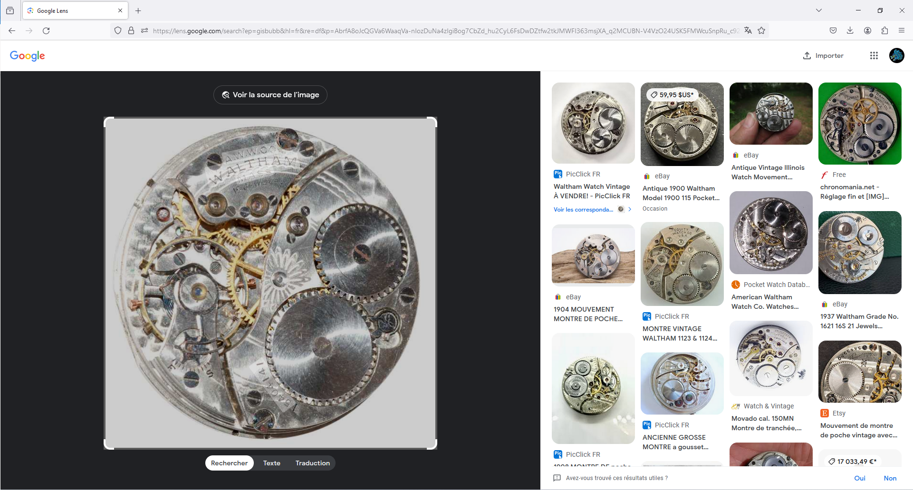
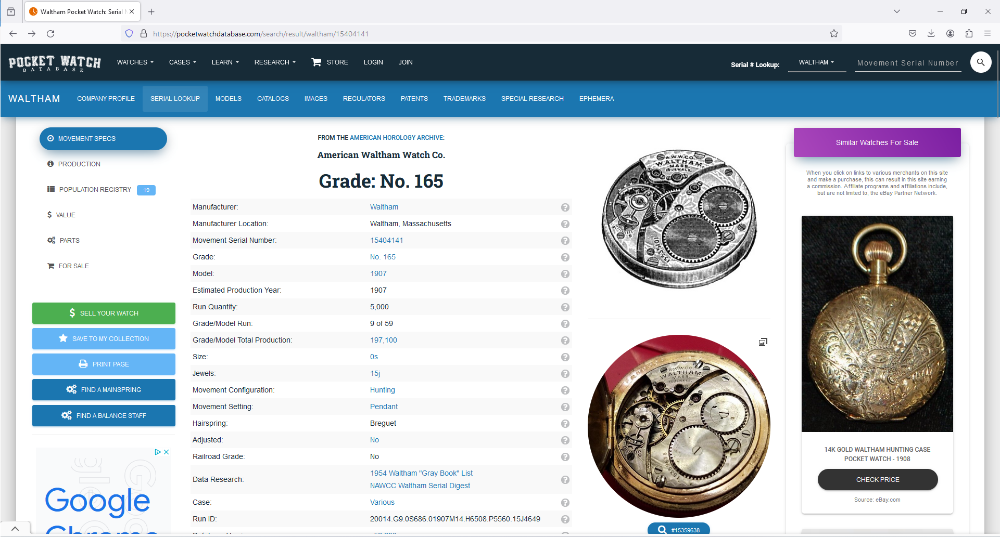

# Not on my watch

***404 CTF WriteUp | Renseignement en sources ouvertes - Facile***

## Énoncé

*Vous êtes arbitre pour l'épreuve de ski de fond et vous accordez une attention particulière à tout ce qui touche au temps.*

*Cependant, en vous réveillant le matin de la compétition, vous vous rendez compte que votre belle montre de poche s'est arrêtée pendant la nuit. Vous la démontez et vous rendez compte que le mécanisme a l'air endommagé.*

*Sous le coup de la déception, vous entreprenez de trouver un nouveau mécanisme pour celle-ci. Vous vous renseignez donc sur le nombre de mécanismes qui ont été produits.*

*Si 1,000,387 mécanismes ont été produits, le format du flag sera:*
*Format du flag : 404CTF{1,000,387}*

Le fichier `pocket_watch.jpg` nous est fourni *(dispo sur le git)*. Voici à quoi il ressemble :

## Une montre, ok, mais laquelle ?

Voici déjà les informations visuelles qu'on peut récolter à partir de l'image fournie : 
-  *A.W.W.CO*, c'est [American Waltham Watch Company](https://en.wikipedia.org/wiki/Waltham_Watch_Company)
-   *WALTHAM* est une ville du Massachusetts, d'où l'inscription *MASS.*
- Notre modèle corresponds à *15 JEWELS* (sûrement plusieurs valeurs possibles)
-   *15404141* est notre potentiel numéro de série

Basons les débuts de nos recherches sur cette image, et voyons ce que *Google Lens* a à nous dire. 

Oh ! Un site semble très intéressant : *[Pocket Watch Database](https://pocketwatchdatabase.com/guide/company/waltham/images?filterSize=0&filterJewels=all&filterMovementSetting=all&filterModels=1900)*. En y jetant un œil, il est possible de rechercher des modèles par numéro de série. En essayant le numéro inscrit sur notre montre, un modèle ressort !

Plus trop de doute possible, tout coïncide : 
- Manufacturer: *Waltham*
- Manufacturer Location: *Waltham, Massachusetts* 
- Jewels: *15j*

## Récupération du flag

Comme indiqué sur le site, `Grade/Model Total Production:	197,100`.
 
Flag : `404CTF{197,100}`

