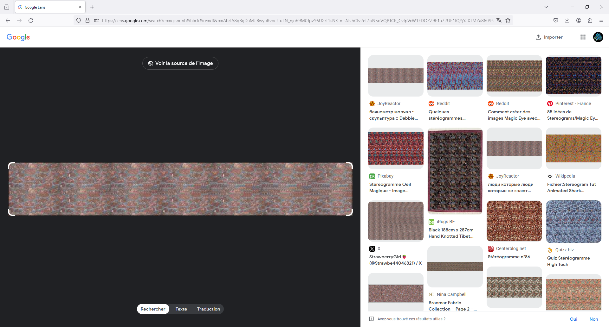
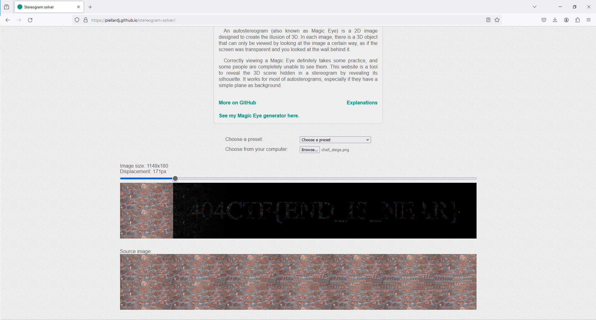

# Regarder en stéréo

***404 CTF WriteUp | Stéganographie - Facile***

## Énoncé

*Ça y est, c'est le grand jour!*

*Vous avez enfin atteint le niveau professionnel et, il faut faire vos preuves lors de cette première compétition. Le début de votre enchaînement gymnastique se déroule bien jusqu'à ce que votre plus grande peur se réalise. Une mauvaise réception en amenant une autre, vous ne contrôlez plus votre élan et tentez de vous rattraper tant bien que mal. Malheureusement, vous finissez par atterrir un peu trop loin en dehors des tapis.*

*Voici la dernière vision que vous avez avant de heurter le sol, est-ce que quelque chose peut encore vous aider?*

Le fichier `chall_stega.png` nous est fourni *(dispo sur le git)*. Voici à quoi il ressemble :

## Hmm, stéréo ?

Après avoir testé les outils classique de stegano pour les images (StegHide, Exiftool, Identify, PngCheck, StegDetect), et sans franc succès, je me suis dit que la solution devait sûrement être plus visuelle, que dans les métadonnées. Une idée a alors été de faire une recherche inversée d'image, car ce genre d'image m'étais totalement inconnu. 

Un mot clé ressors, qui attire mon attention : `stéréogramme`. Une simple recherche et on tombe sur [cette page wiki](https://fr.wikipedia.org/wiki/Autost%C3%A9r%C3%A9ogramme). 

## Récupération du flag

En recherchant un solveur d'autostéréogramme en ligne, on tombe sur [ce site](https://piellardj.github.io/stereogram-solver/), essayons d'upload notre image :

 
Flag : `404CTF{END_IS_NEAR}`

