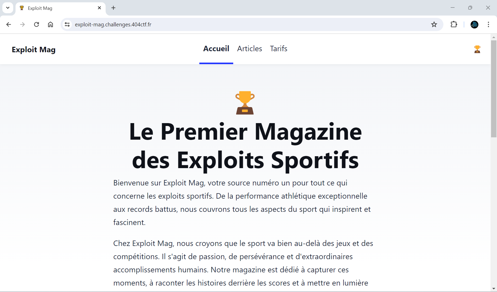
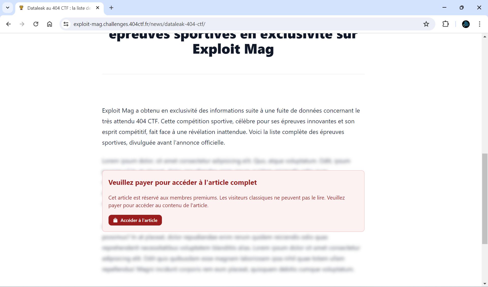
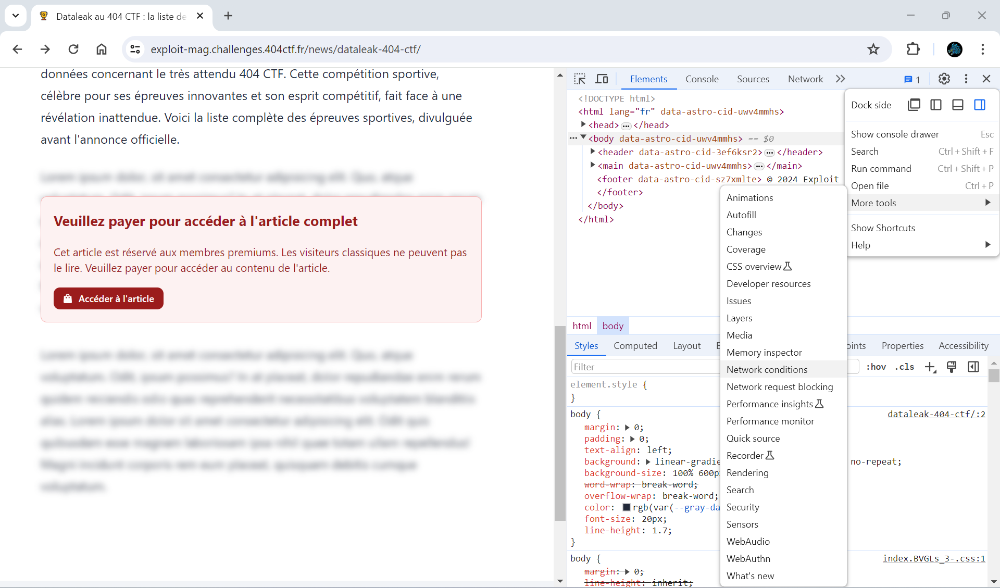
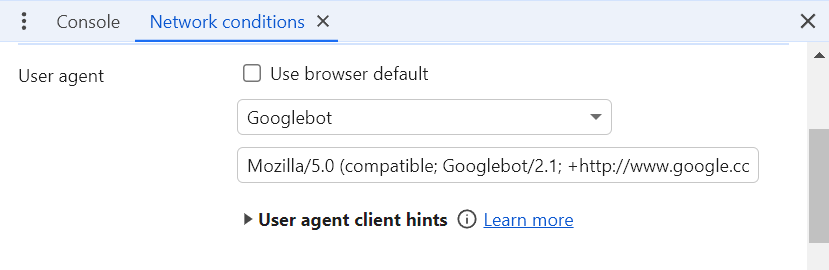
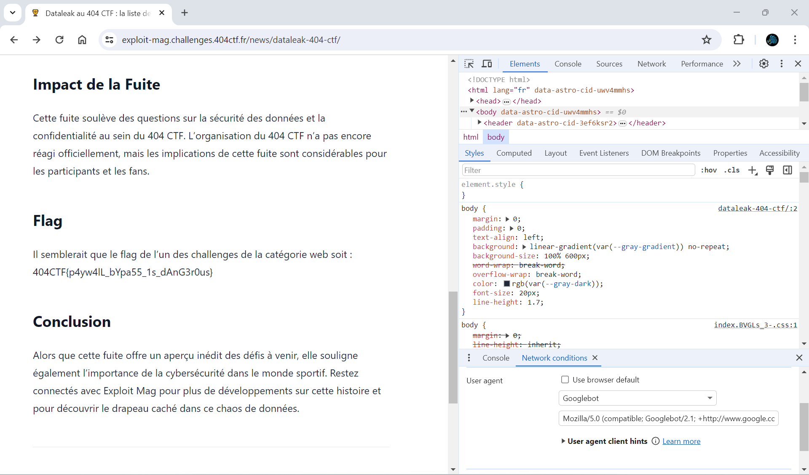

# Exploit mag

***404 CTF WriteUp | Web - Facile***

## Énoncé

*Alors que la compétition bat son plein, votre entraîneur vient à votre rencontre :*

-   *Hey ! Je ne sais pas si tu as vu, mais il parait qu'un magazine en ligne a publié des trucs "intéressants" sur la compétition. C'est un ami à moi qui m'a envoyé le lien.*

*En allant jeter un œil, rien ne semble différencier ce magazine d'un autre site sportif aux titres racoleurs... Mais l'un des articles attire votre attention. Ce serait bien de pouvoir y accéder, au moins pour savoir ce qu'ont appris les athlètes qui l'ont lu. Mais pas question de payer, il doit bien exister un autre moyen...*

On nous donne un lien vers le site **[https://exploit-mag.challenges.404ctf.fr](https://exploit-mag.challenges.404ctf.fr)**. Voici à quoi ressemble la page d'accueil : 



## Une histoire de *paywall* ...

Lorsqu'on visite les différentes pages du site, rien d'anormal. Mais l'accès aux différents articles nous est limité, il faudrait payer pour accéder à l'intégralité du contenu. 



Problème : aucun moyen d'accéder à une certaine page de payement, aucun moyen de se connecter ou de créer un compte. Après être resté longtemps (***très longtemps***) devant ce captcha inutile qui tourne dans le vide, j'ai donc décidé de suivre d'autres pistes : peut-être des pages cachées/non indexées ? Allons faire un tour vers */robots.txt* :

```
User-agent: Googlebot-news
Disallow:

User-agent: *
Disallow: /news/
```

Oh, un indice :) En ayant fait quelques recherches sur les *paywall*, et surtout comment les *bypass*, j'ai tout de suite fait le lien avec ce *User-agent* Googlebot !

## Changer son User-agent 

 Essayons de consulter un article en se faisant passer pour un Googlebot (en utilisant un *User-agent* spécifique). Sur Chrome, rien de plus simple : *click droit -> inspect -> ⋮ -> More tools -> Network conditions*. 
 


Dans *User agent*, on décoche *Use Browser default*, et on sélectionne notre Googlebot:


 
## Récupération du flag

On n'a plus qu'à recharger la page avec notre nouveau *User-agent*, et voilà, plus de paywall ! 
Le flag se trouve dans le contenu de l'article *"Dataleak au 404 CTF : la liste des épreuves sportives en exclusivité sur Exploit Mag"* (la page */news/dataleak-404-ctf/*) :



Flag : `404CTF{p4yw4lL_bYpa55_1s_dAnG3r0us}`


