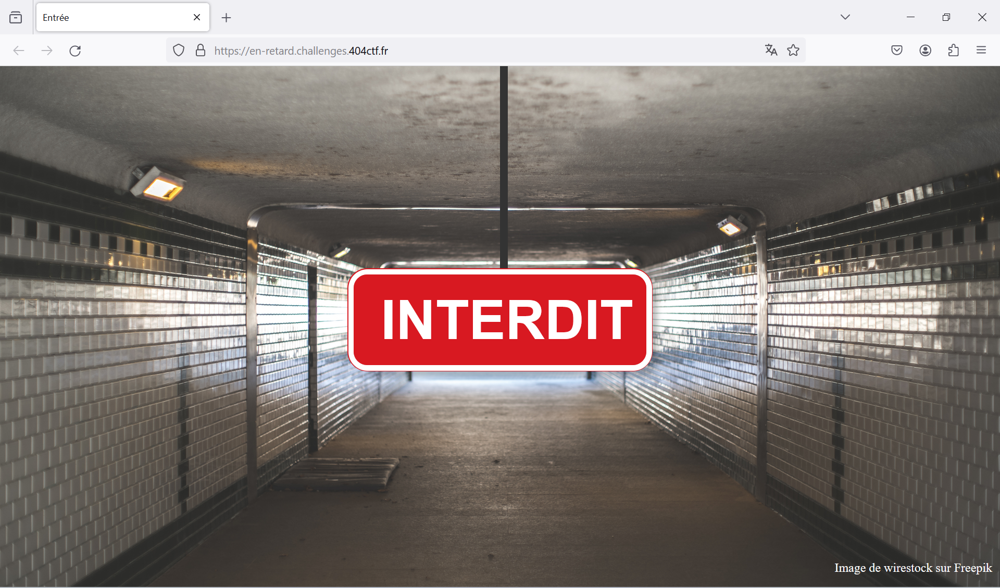
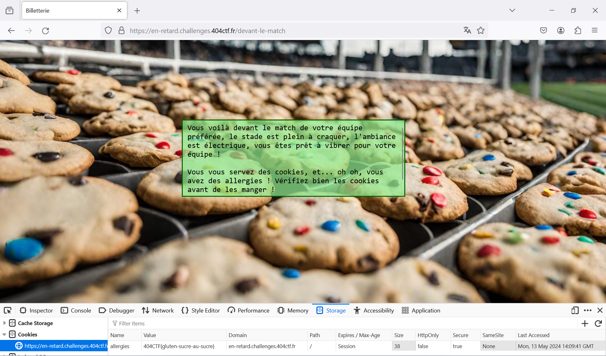

# Vous êtes en RETARD

***404 CTF WriteUp | Web - Introduction***

## Énoncé

*Vous voilà devant le stade pour voir le dernier match de votre équipe préférée, le Gorfou FC !  
Malheureusement, vous êtes arrivé.e en retard et l'entrée est fermée... Mais pas de panique, il vous suffit de trouver un moyen pour quand même rentrer !*

On nous donne un lien vers le site **https://en-retard.challenges.404ctf.fr/**. Voici à quoi ressemble la page d'accueil : 



## Inspection du code-source

En inspectant le code-source de la page, je remarque un bouton *ENTRER*, il est caché par le panneau (la *div* juste en dessous).


Comme l'indique l'event *on click* du bouton, celui-ci nous redirige vers la page **/donnez-moi-mon-ticket-pitie**.

 

On arrive alors sur cette page : 

 

Effectivement, comme indiqué sur la page, lorsqu'on essaye de valider le billet, une pop-up nous indique *"Billet non validé"*.
Regardons le javascript déclenché par ce bouton : 

```javascript
function() {
  if (window.validable.includes(billet.id)) {
    fetch('/set_cookie', {
      method: 'POST'
    }).then(function() {
      window.location.href = "/devant-le-match";
    });
  } else {
    alert('Billet non validé');
  }
}
```

Si on essaye d'accéder directement à la page */devant-le-match*, on est redirigé vers la page d'accueil, avec ce message :  


## Récupération du flag

Pour éviter de se faire refuser l'accès devant le match, il nous faut un cookie, et comme nous l'indique le JS du bouton de validation de ticket, il suffit de faire un *POST* à */set-cookie*, puis un *GET* vers  */devant-le-match*. 

> Bien sûr, pas besoin de faire les 2 requêtes à la main, il suffit de copier-coller ***bêtement*** le JS qui nous intéresse dans la console :)

Cette fois-ci, on est bien redirigé devant le match ! 



Le flag se trouve dans la valeur du cookie *allergies*.

Flag : `404CTF{gluten-sucre-au-sucre}`


