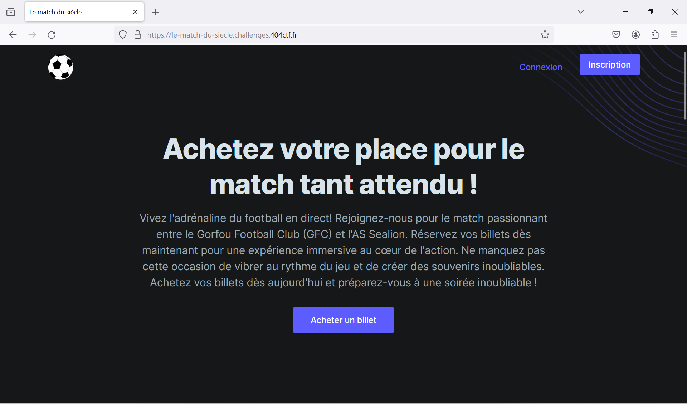
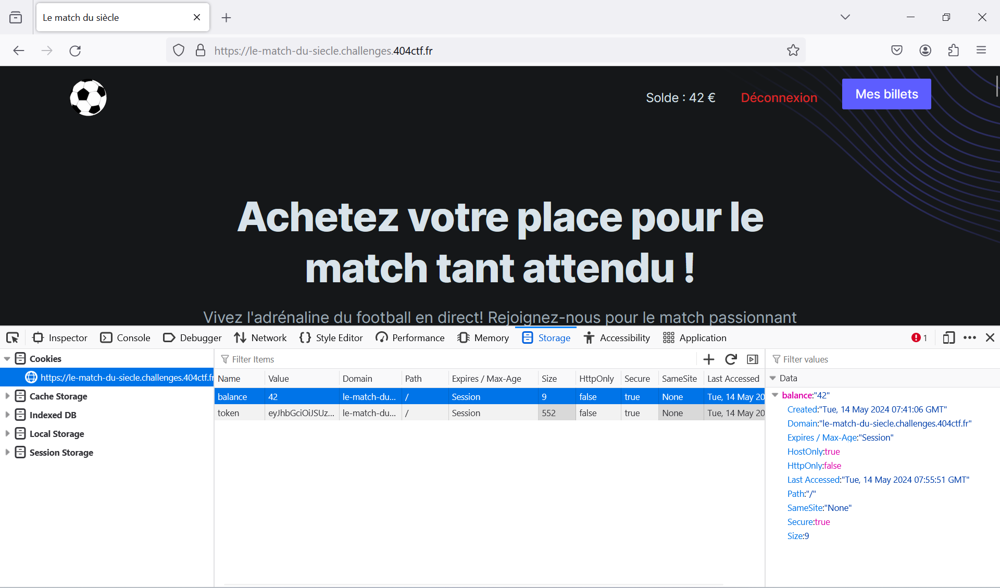

# Le match du siècle [1/2]

***404 CTF WriteUp | Web - Introduction***

## Énoncé

*Vous voilà à quelques semaines du match tant attendu entre le Gorfou FC et l'AS Sealion.  
Seulement, vous vous êtes pris au dernier moment pour acheter votre place. Trouvez un moyen d'obtenir un billet !*

On nous donne un lien vers le site **[https://le-match-du-siecle.challenges.404ctf.fr](https://le-match-du-siecle.challenges.404ctf.fr)**. Voici à quoi ressemble la page d'accueil : 

## Modifier son solde

Après avoir créé un compte, puis s'y être connecté, on se retrouve sur la même page d'accueil, avec cette fois-ci un solde (qui est de 0€) et un bouton *Mes billets*, qui redirige vers une page */billets* (pour l'instant vide).

Comme l'indique la notification *Solde insuffisant*, l'achat d'un billet ne nous est pas autorisé, à cause de notre solde de 0€. Il faut donc trouver un moyen de pouvoir changer la valeur de ce solde. Ma première idée a été de regarder du côté des cookies/tokens de session, qui contiennent souvent des infos utile relatif à l'utilisateur connecté.

 

Bingo ! 2 cookies sont présents : *token* et *balance*, ce dernier qui a une valeur de 0. Tout coïncide, il s'agit très probablement de la valeur de notre solde, stockée sans aucune protection du côté user dans un simple token de session ! Essayons de modifier cette valeur, et de rafraichir notre page : 

 

Comme indiqué en haut de la page, notre solde est bien modifié. Il n'y a plus qu'à réessayer l'achat d'un billet.

Sans encombre cette fois-ci, on a bien obtenu un billet en *Tribune Latérale* !
 
## Récupération du flag

Sur la page */billets*, on clique sur *Obtenir* à côté de notre billet. Un fichier PNG se télécharge.

Le flag est en clair sur notre image PNG.

Flag : `404CTF{b5a77ed0fa6968b21df7fb137437fae1}`

